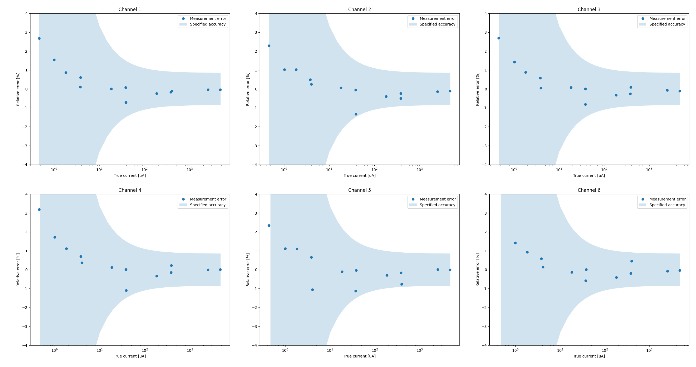

# LightSoak Hardware
This repository contains hardware design files for LightSoak project, developed in scope of my Master's thesis. For Firmware, quick start quide and a basic hardware description, see https://github.com/mrmp17/LightSoakFW-STM. For Python data logger, see https://github.com/mrmp17/LightSoakFW-Python.

LightSoak hardware can be used standalone via a Command Line Interface over USB or with a Python data logger to implement complex measurement sequences. See quick start quide at https://github.com/mrmp17/LightSoakFW-STM for more information.

## Hardware specs

### Voltage measurement channels
- Measurement range: **0-1.5V**
- ADC resolution: **12bit (STM32G4 integrated)**
- Sample rate: **100kHz**
- Differential input resistance: **3.3MOhm +- 10% (1GOhm +- 10% if input buffer board is used)**
- Noise performance: *TBD*. Use *getnoise* CLI command to evaluate.
    - *Note: Noise performance can be improved significantly by usage of the input buffer board*
- Over-range protection: **None**
- Accuracy: **+-(0.25% of measurement + 0.75mV)**

#### Voltage accuracy report

- Calibration date: 5.9.2023
- Calibration equipment:
    - Keithly 237 (ULFE: 037296)
    - Agilent 34401A (ULFE: FE24)
- Sample averaging: 2000 (20ms averaging time)

### Current measurement channels
- Measurement ranges:
    - 1X: *up to 4700uA*
    - 10X: *up to 400uA*
    - 100X: *up to 40uA*
    - 1000X: *up to 4uA*
- ADC resolution: **12bit (STM32G4 integrated)**
- Sample rate: **100kHz** (simultaneous sampling with voltage channels)
- Noise performance: *TBD*. Use *getnoise* CLI command to evaluate.
- Over-range protection: **None**
- Accuracy: **+-(0.85% of measurement + 0.25uA)**
    - *Note: With shunt range optimization, higher accuracy can be reached. This is accuracy through the whole range including range switching.*
    - *Note: If the input buffer board is not used, voltage measurement circuitry loads the DUT with about 3.3Mohm. While measuring very small currents, this can cause a discrepancy between the measured and actual DUT current.

#### Current accuracy report

- Calibration date: 13.9.2023
- Calibration equipment:
    - BM789
- Sample averaging: 2000 (20ms averaging time)

### Temperature control
- Handled by a TEC-1091 module mounted to the main board. See https://www.meerstetter.ch/products/tec-controllers/tec-1091 for specs.
- For continous max-power operation of temperature control, additional cooling is recomended for the power supply and TEC module section.

### Illumination (verification TBD)
- Light output stbility: **+-1% (With LED temperature compensation)**
- Constant current range: **50mA to 1.4A**
    - *Note: Lower currents are possible with reduced transient performance*
- Settling time: **100uS to steady state, over current range**
    - *Note: Settling time is significantly shorter for higher currents. *
- See https://downloads.cree-led.com/files/ds/x/XLamp-CXA2530.pdf for LED specs

### Power supply requirements
- **42V 2.5A DC** on input terminals to support all functionality.
- 5V 1A USB supply only (*VBUS-PWR* jumper installed): Analog functions work, performance may be degraded.
